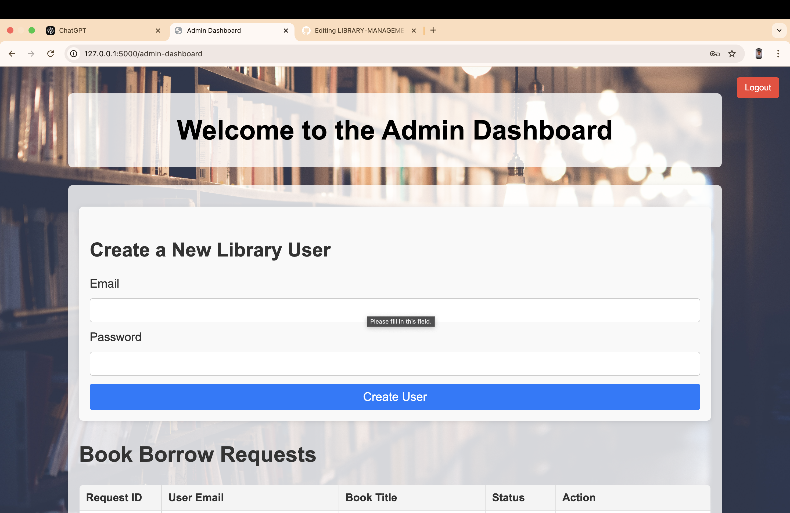
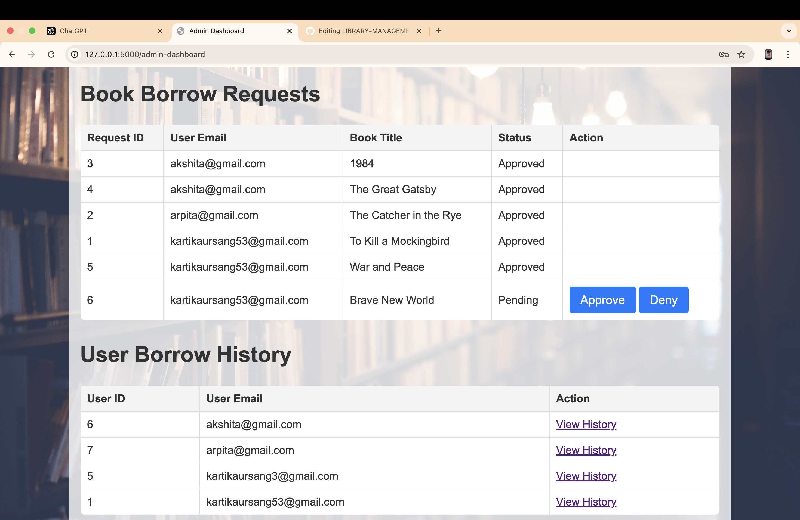

# Library Management System

## Description

This is a Library Management System built with **Flask** and **MySQL** that allows both users and administrators to log in, borrow books, view borrowing history, and approve/deny borrowing requests.

### TECHNOLOGY USED:
- **BACKEND**: python
- **FRONTEND**: html,css.
- **DaTABASE**: MySql
- **DEPENDENCIES**:Flask,mysql-connector-python

### Key Features:
- **User Login**: Users can log in using their email and password.
- **Admin Login**: Admin can log in and manage book borrowing requests.
- **Book Borrowing**: Users can borrow books by specifying the dates they want to borrow the book.
- **Borrowing History**: Users can view their borrowing history, and admins can manage and approve/deny borrow requests.
- **CSV Export**: Users can download their borrowing history as a CSV file.
  
## Routes

- `/`: Home page
- `/user-login`: User login page
- `/admin-login`: Admin login page
- `/user-dashboard`: User dashboard to view available books and borrowing history
- `/borrow-book`: Endpoint for borrowing a book
- `/admin-dashboard`: Admin dashboard to manage borrow requests
- `/user_history/<int:user_id>`: View the borrowing history of a user
- `/download-history/<int:user_id>`: Download a CSV of the user's borrowing history
- `/logout`: Logs out the user and redirects to the home page

## DIRECTORY

**library-management/**
- ├── app.py            
- ├── templates/       
- │     ├── index.html      
- │     ├── user_login.html
- │     ├── admin_login.html
- │     ├── user_dashboard.html 
- │     └── admin_dashboard.html 
- └── requirements.txt    
- ├── static/
- |images/
- │     ├── styles.css     
- │     ├── style.css
- │     ├── user_dashboard.css
- │     ├── user_histor.css
- │     └── admin_dashboard.css
- └── requirements.txt    # List of Python dependencies

## Usage

- **User Login**: Enter your email and password to log in as a user.
- **Admin Login**: Admins can log in with their credentials to manage book borrowing requests.
- **Borrow Books**: Users can select available books and specify borrowing dates.
- **Download Borrowing History**: Users can download their borrowing history in CSV format.
- **Admin Dashboard**: Admins can approve or deny borrow requests for books.

## Output

1. **Main Page**:
   - Displays two login buttons:
     - **User Login**: Redirects to the user login page where users can log in with their email and password.
     - **Admin Login**: Redirects to the admin login page for administrators to log in and manage book borrowing requests.
       
       
       
2. **User Dashboard**:
   - After a successful login, users can view available books, borrow books by specifying dates, and view their borrowing history And Download the history (csv file).
      

3. **Admin Dashboard**:
   - Admins can log in to manage book borrowing requests. They can approve or deny requests from users.
       
       
     
4. **Borrow History**:
   - ADMIN  can view ALL USERS borrowing history, which includes a list of books they've borrowed, the dates they borrowed them.
        
